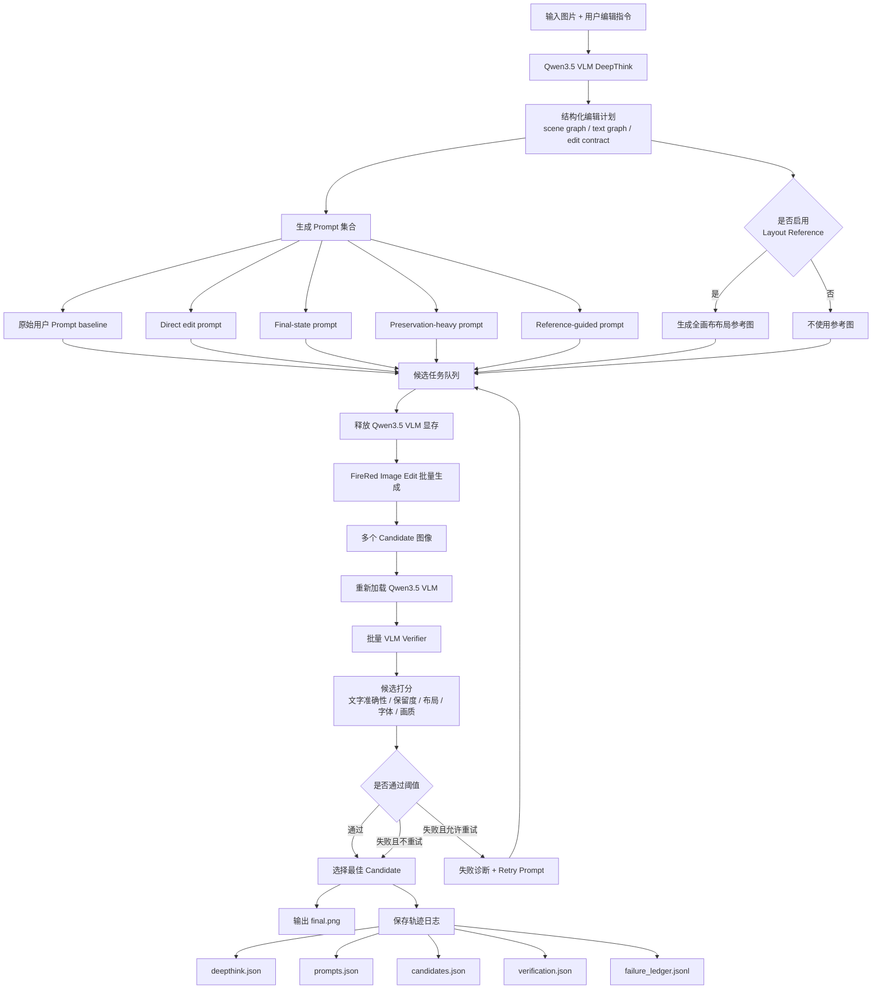

```mermaid
flowchart TD
    A[输入图片 + 用户编辑指令] --> B[Qwen3.5 VLM DeepThink]
    B --> C[结构化编辑计划<br/>scene graph / text graph / edit contract]
    C --> D[生成 Prompt 集合]

    D --> D0[原始用户 Prompt baseline]
    D --> D1[Direct edit prompt]
    D --> D2[Final-state prompt]
    D --> D3[Preservation-heavy prompt]
    D --> D4[Reference-guided prompt]

    C --> E{是否启用<br/>Layout Reference}
    E -->|是| F[生成全画布布局参考图]
    E -->|否| G[不使用参考图]

    D0 --> H[候选任务队列]
    D1 --> H
    D2 --> H
    D3 --> H
    D4 --> H
    F --> H
    G --> H

    H --> I[释放 Qwen3.5 VLM 显存]
    I --> J[FireRed Image Edit 批量生成]
    J --> K[多个 Candidate 图像]

    K --> L[重新加载 Qwen3.5 VLM]
    L --> M[批量 VLM Verifier]
    M --> N[候选打分<br/>文字准确性 / 保留度 / 布局 / 字体 / 画质]

    N --> O{是否通过阈值}
    O -->|通过| P[选择最佳 Candidate]
    O -->|失败且允许重试| Q[失败诊断 + Retry Prompt]
    Q --> H
    O -->|失败且不重试| P

    P --> R[输出 final.png]
    P --> S[保存轨迹日志]
    S --> S1[deepthink.json]
    S --> S2[prompts.json]
    S --> S3[candidates.json]
    S --> S4[verification.json]
    S --> S5[failure_ledger.jsonl]
```